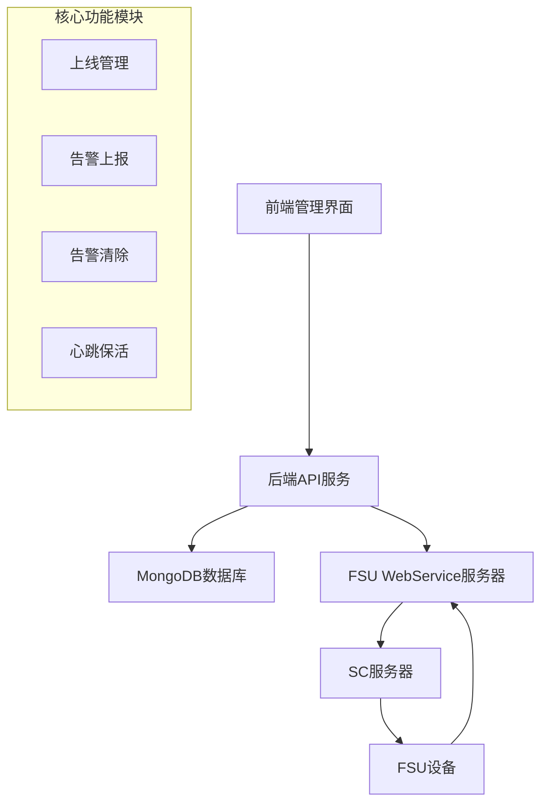
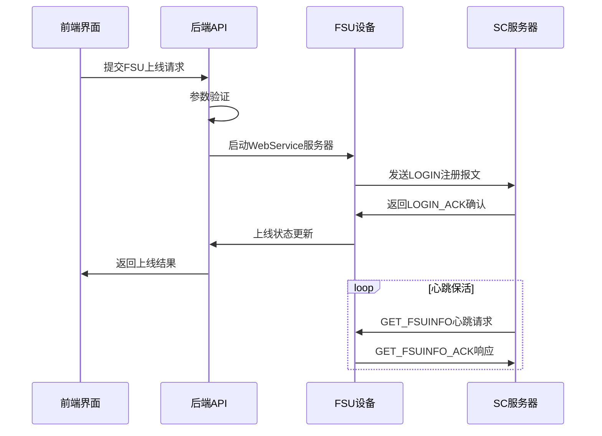
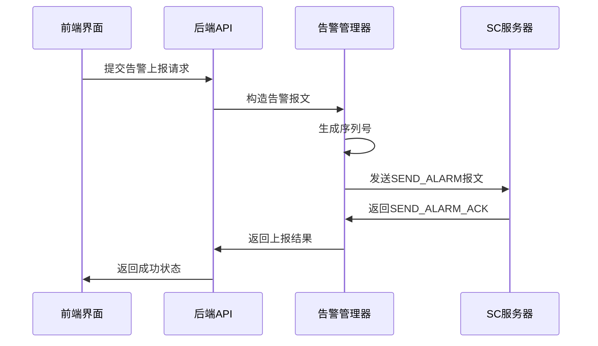
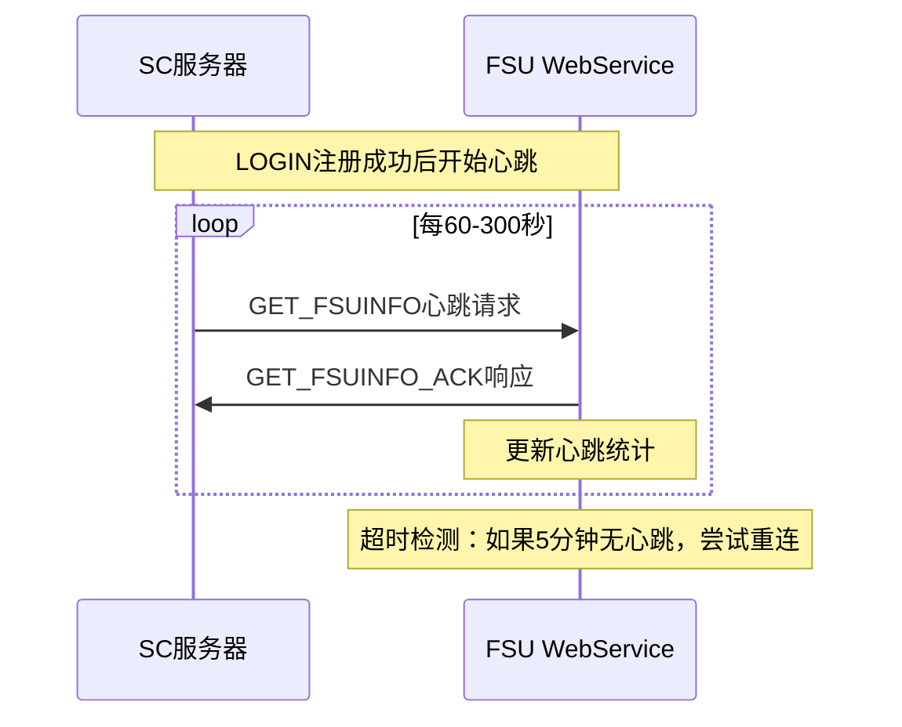

# FSU 系统技术规范与 API 文档

> 基于中国铁塔动环监控系统 统一互联 B 接口技术规范实现的完整 FSU 监控管理系统

## 📋 目录

1. [系统概述](#1-系统概述)
2. [FSU 上线流程](#2-fsu上线流程)
3. [报文格式规范](#3-报文格式规范)
4. [告警管理功能](#4-告警管理功能)
5. [心跳保活机制](#5-心跳保活机制)
6. [API 接口文档](#6-api接口文档)
7. [数据库设计](#7-数据库设计)
8. [部署与运维](#8-部署与运维)

---

## 1. 系统概述

### 1.1 架构设计



### 1.2 技术栈

**后端技术**：

- Node.js + Express.js
- MongoDB + Mongoose
- SOAP WebService
- Winston 日志系统

**前端技术**：

- React 18
- Ant Design 5.x
- Axios HTTP 客户端

**协议标准**：

- 中国铁塔 B 接口规范
- HTTP + SOAP + XML
- WebService 通信

---

## 2. FSU 上线流程

### 2.1 完整上线流程



### 2.2 上线关键步骤

#### 步骤 1：IP 地址检测

```javascript
// 自动检测内网IP（VPN优先）
function getMyInternalIP() {
  const interfaces = os.networkInterfaces();

  // 优先级：VPN > 10.x.x.x > 192.168.x.x
  for (const [name, addrs] of Object.entries(interfaces)) {
    if (name.toLowerCase().includes("vpn")) {
      // VPN接口优先
      return findValidIP(addrs);
    }
  }

  // 备选内网地址
  return findPrivateIP(interfaces);
}
```

#### 步骤 2：WebService 服务器启动

```javascript
// 启动FSU WebService服务器（端口8080）
class FSUWebServiceServer {
  constructor() {
    this.app = express();
    this.port = 8080;
    this.setupMiddleware();
    this.setupRoutes();
  }

  start() {
    return new Promise((resolve, reject) => {
      this.server = this.app.listen(this.port, () => {
        console.log(
          `FSU WebService启动成功: http://${this.getLocalIP()}:${this.port}`
        );
        resolve();
      });
    });
  }
}
```

#### 步骤 3：LOGIN 注册报文发送

```javascript
// 向SC服务器发送LOGIN注册
async function sendDirectLogin(fsuData) {
  const loginXml = buildRegisterXml(fsuData);

  const response = await axios.post(
    `http://${SC_SERVER_IP}:8080/services/SCService`,
    loginXml,
    {
      headers: {
        "Content-Type": "text/xml; charset=utf-8",
        SOAPAction: '"invoke"',
        "User-Agent": "FSU-ZXLW/DAM-2160I-RH",
      },
      timeout: 30000,
    }
  );

  return parseLoginResponse(response.data);
}
```

### 2.3 FSU 设备信息结构

```javascript
const fsuData = {
  // 基本标识信息
  fsuId: "61082143802203", // FSU ID（11位）
  fsuCode: "61082143802203", // FSU 编码
  siteName: "北京朝阳基站", // 站点名称

  // 网络配置信息
  internalIP: "10.4.15.173", // 内网IP（自动检测）
  scServerAddress: "192.168.1.10", // SC服务器地址
  mainVpn: "sn.toweraiot.cn:1194", // 主VPN地址

  // 设备硬件信息
  macId: "869221025266666", // MAC地址
  imsiId: "460068161666666", // IMSI号码
  networkType: "4G", // 网络类型
  lockedNetworkType: "LTE", // 锁定网络类型
  carrier: "CU", // 运营商

  // 厂商信息
  softwareVendor: "华为", // 软件厂家
  hardwareVendor: "中兴", // 硬件厂家
  fsuType: "动环监控", // FSU类别
  fsuVendor: "ZXLW", // FSU厂商
  softwareVersion: "V2.1.0", // 软件版本

  // 关联设备列表
  devices: [
    "61082140601589", // 交流电源1
    "61082141820991", // 烟感设备01
    "61082140702618", // 蓄电池1
    "61082140702619", // 蓄电池2
    "61082141841251", // 水浸01
    "61082143802203", // FSU自身
    "61082141831306", // 温湿感01
  ],
};
```

---

## 3. 报文格式规范

### 3.1 LOGIN 注册报文

#### 请求报文（LOGIN - Code: 101）

```xml
<?xml version="1.0" encoding="UTF-8"?>
<Request>
  <PK_Type>
    <Name>LOGIN</Name>
    <Code>101</Code>
  </PK_Type>
  <Info>
    <UserName>1111</UserName>
    <PaSCword>1111</PaSCword>
    <FsuId>61082143802203</FsuId>
    <FsuCode>61082143802203</FsuCode>
    <FsuIP>10.4.15.173</FsuIP>
    <MacId>869221025266666</MacId>
    <ImsiId>460068161666666</ImsiId>
    <NetworkType>4G</NetworkType>
    <LockedNetworkType>LTE</LockedNetworkType>
    <Carrier>CU</Carrier>
    <NMVendor>大唐</NMVendor>
    <NMType>DTM-W101T</NMType>
    <Internet_mode>wireless</Internet_mode>
    <Reg_Mode>2</Reg_Mode>
    <FSUVendor>ZXLW</FSUVendor>
    <FSUType>ZNV EISUA X7</FSUType>
    <FSUClass>INTSTAN</FSUClass>
    <Version>24.1.HQ.FSU.LW.4417.R</Version>
    <DictVersion>1</DictVersion>
    <DeviceList>
      <Device Id="61082140601589" Code="61082140601589"/>
      <Device Id="61082141820991" Code="61082141820991"/>
      <Device Id="61082140702618" Code="61082140702618"/>
      <Device Id="61082140702619" Code="61082140702619"/>
      <Device Id="61082141841251" Code="61082141841251"/>
      <Device Id="61082143802203" Code="61082143802203"/>
      <Device Id="61082141831306" Code="61082141831306"/>
    </DeviceList>
    <MainVPN>sn.toweraiot.cn,sn.toweraiot.cn</MainVPN>
    <MainVPN_One>sn.toweraiot.cn,sn.toweraiot.cn</MainVPN_One>
    <MainVPN_Two>sn.toweraiot.cn,sn.toweraiot.cn</MainVPN_Two>
    <Disaster_Recovery_One>zb-sn.toweraiot.cn,zb-sn.toweraiot.cn</Disaster_Recovery_One>
  </Info>
</Request>
```

#### 响应报文（LOGIN_ACK - Code: 102）

```xml
<?xml version="1.0" encoding="UTF-8"?>
<Response>
  <PK_Type>
    <Name>LOGIN_ACK</Name>
    <Code>102</Code>
  </PK_Type>
  <Info>
    <SCIP>192.168.1.100</SCIP>
    <RightLevel>1</RightLevel>
  </Info>
</Response>
```

### 3.2 SOAP 包装格式

对于通过 WebService 发送的报文，需要使用 SOAP envelope 包装：

```xml
<?xml version="1.0" encoding="utf-8"?>
<soapenv:Envelope xmlns:soapenv="http://schemas.xmlsoap.org/soap/envelope/">
  <soapenv:Header/>
  <soapenv:Body>
    <ns1:invoke xmlns:ns1="http://webservice/">
      <ns1:xmlStr><![CDATA[
        <!-- 这里放置实际的LOGIN或其他XML报文 -->
      ]]></ns1:xmlStr>
    </ns1:invoke>
  </soapenv:Body>
</soapenv:Envelope>
```

---

## 4. 告警管理功能

### 4.1 告警上报流程



### 4.2 告警上报报文

#### SEND_ALARM 请求（Code: 501）

```xml
<?xml version="1.0" encoding="UTF-8"?>
<Request>
  <PK_Type>
    <Name>SEND_ALARM</Name>
    <Code>501</Code>
  </PK_Type>
  <Info>
    <Values>
      <TAlarmList>
        <TAlarm>
          <SerialNo>1234567890</SerialNo>
          <Id></Id>
          <FsuId>61082143802203</FsuId>
          <FsuCode>61082143802203</FsuCode>
          <DeviceId>61082141841251</DeviceId>
          <DeviceCode>61082141841251</DeviceCode>
          <AlarmTime>2024-01-15 14:25:30</AlarmTime>
          <AlarmLevel>二级</AlarmLevel>
          <AlarmFlag>BEGIN</AlarmFlag>
          <AlarmDesc>水浸告警</AlarmDesc>
        </TAlarm>
      </TAlarmList>
    </Values>
  </Info>
</Request>
```

#### SEND_ALARM_ACK 响应（Code: 502）

```xml
<?xml version="1.0" encoding="UTF-8"?>
<Response>
  <PK_Type>
    <Name>SEND_ALARM_ACK</Name>
    <Code>502</Code>
  </PK_Type>
  <Info>
    <Result>1</Result>
  </Info>
</Response>
```

### 4.3 告警清除流程

告警清除使用相同的 SEND_ALARM 报文格式，但将`AlarmFlag`设置为`END`：

```xml
<TAlarm>
  <SerialNo>1234567890</SerialNo>
  <FsuId>61082143802203</FsuId>
  <DeviceId>61082141841251</DeviceId>
  <AlarmTime>2024-01-15 14:30:00</AlarmTime>
  <AlarmFlag>END</AlarmFlag>
  <AlarmDesc>水浸告警</AlarmDesc>
</TAlarm>
```

### 4.4 关键实现代码

```javascript
class AlarmManager {
  // 上报告警
  async reportAlarm(params, sendToSC = false, sendMethod = "soap") {
    const {
      deviceId,
      fsuId = "61082143802203",
      monitorPointId,
      alarmLevel,
      alarmDesc,
    } = params;

    // 生成唯一的告警序号（10位数字）
    const serialNo = this.generateAlarmSerialNo();

    // 构造告警数据
    const alarmData = {
      serialNo,
      deviceId,
      alarmTime: this.getCurrentTimestamp(),
      fsuId,
      monitorPointId,
      alarmLevel,
      alarmFlag: "BEGIN", // 上报使用BEGIN
      alarmDesc,
    };

    // 生成SEND_ALARM请求报文
    const sendAlarmRequest = this.generateSendAlarmRequest(alarmData);

    if (sendToSC) {
      return await this.sendAlarmToSC(sendAlarmRequest, sendMethod);
    }

    return { success: true, alarmData, sendAlarmRequest };
  }

  // 清除告警
  async clearAlarm(params, sendToSC = false, sendMethod = "soap") {
    // 类似上报，但使用alarmFlag: "END"
    const alarmData = {
      ...params,
      alarmFlag: "END", // 清除使用END
      alarmTime: this.getCurrentTimestamp(),
    };

    const clearAlarmRequest = this.generateSendAlarmRequest(alarmData);

    if (sendToSC) {
      return await this.sendAlarmToSC(clearAlarmRequest, sendMethod);
    }

    return { success: true, alarmData, clearAlarmRequest };
  }
}
```

---

## 5. 心跳保活机制

### 5.1 心跳工作原理



### 5.2 心跳报文格式

#### GET_FSUINFO 请求（Code: 1701）

```xml
<?xml version="1.0" encoding="UTF-8"?>
<Request>
  <PK_Type>
    <Name>GET_FSUINFO</Name>
    <Code>1701</Code>
  </PK_Type>
  <Info>
    <FsuId>61082143802203</FsuId>
  </Info>
</Request>
```

#### GET_FSUINFO_ACK 响应（Code: 1702）

```xml
<?xml version="1.0" encoding="UTF-8"?>
<Response>
  <PK_Type>
    <Name>GET_FSUINFO_ACK</Name>
    <Code>1702</Code>
  </PK_Type>
  <Info>
    <FsuId>61082143802203</FsuId>
    <Result>1</Result>
  </Info>
</Response>
```

### 5.3 心跳统计监控

```javascript
class HeartbeatManager {
  constructor() {
    this.heartbeatStats = {
      total: 0,
      success: 0,
      failed: 0,
      lastHeartbeatTime: null,
      startTime: new Date(),
    };
  }

  // 每60秒显示心跳统计
  startHeartbeatMonitoring() {
    setInterval(() => {
      this.showHeartbeatStats();
    }, 60000);
  }

  showHeartbeatStats() {
    const stats = this.heartbeatStats;
    const successRate =
      stats.total > 0 ? ((stats.success / stats.total) * 100).toFixed(1) : 0;

    const timeSinceLastHeartbeat = stats.lastHeartbeatTime
      ? Math.floor((Date.now() - stats.lastHeartbeatTime) / 1000)
      : 0;

    console.log(`📊 [${new Date().toLocaleTimeString()}] 心跳统计:`);
    console.log(`   💗 总心跳数: ${stats.total}`);
    console.log(`   ✅ 成功: ${stats.success}`);
    console.log(`   ❌ 失败: ${stats.failed}`);
    console.log(`   📈 成功率: ${successRate}%`);
    console.log(`   ⏱️  距离上次心跳: ${timeSinceLastHeartbeat}秒`);
  }
}
```

---

## 6. API 接口文档

### 6.1 FSU 上线管理 API

#### 获取 FSU 上线列表

```http
GET /api/fsu/online/list
```

**查询参数**：

```javascript
{
  page: 1,                    // 页码
  pageSize: 10,              // 每页数量
  fsuid: "",                 // FSU ID筛选
  siteName: "",              // 站点名称筛选
  softwareVendor: "",        // 软件厂家筛选
  hardwareVendor: "",        // 硬件厂家筛选
  fsuType: "",               // FSU类别筛选
  scServerAddress: "",       // SC服务器地址筛选
  creator: ""                // 创建人筛选
}
```

**响应示例**：

```json
{
  "success": true,
  "data": {
    "list": [
      {
        "id": "64f5a1b2c8d9e1a2b3c4d5e6",
        "fsuid": "61082143802203",
        "siteName": "北京朝阳基站",
        "scServerAddress": "192.168.1.10",
        "mainVpn": "sn.toweraiot.cn:1194",
        "softwareVendor": "华为",
        "hardwareVendor": "中兴",
        "fsuType": "动环监控",
        "version": "V2.1.0",
        "status": "online",
        "creator": "admin",
        "createTime": "2024-01-15T10:30:00.000Z",
        "updateTime": "2024-01-15T10:30:00.000Z"
      }
    ],
    "total": 1,
    "page": 1,
    "pageSize": 10
  }
}
```

#### 添加 FSU 上线记录

```http
POST /api/fsu/online
```

**请求体**：

```json
{
  "fsuid": "61082143802203",
  "siteName": "北京朝阳基站",
  "scServerAddress": "192.168.1.10",
  "mainVpn": "sn.toweraiot.cn:1194",
  "softwareVendor": "华为",
  "hardwareVendor": "中兴",
  "fsuType": "动环监控",
  "version": "V2.1.0",
  "powerId": "PWR001",
  "batteryId": "BAT001",
  "temperatureId": "TEMP001",
  "airConditionerId": "AC001"
}
```

### 6.2 告警管理 API

#### 上报告警

```http
POST /api/alarm/report
```

**请求体**：

```json
{
  "fsuid": "61082143802203",
  "signalId": "0418001001",
  "alarmDesc": "水浸告警",
  "deviceId": "61082141841251",
  "collectorIp": "192.168.1.100"
}
```

#### 清除告警

```http
POST /api/alarm/clear
```

**请求体**：

```json
{
  "fsuid": "61082143802203",
  "signalId": "0418001001",
  "alarmDesc": "水浸告警",
  "deviceId": "61082141841251",
  "collectorIp": "192.168.1.100"
}
```

---

## 7. 数据库设计

### 7.1 FSU 上线记录集合（fsu_online）

```javascript
const FsuOnlineSchema = {
  fsuid: String, // FSU ID（唯一）
  siteName: String, // 站点名称
  scServerAddress: String, // SC服务器地址
  mainVpn: String, // 主VPN地址
  softwareVendor: String, // 软件厂家
  hardwareVendor: String, // 硬件厂家
  fsuType: String, // FSU类别
  version: String, // 版本

  // 设备关联信息
  powerId: String, // 电源ID
  batteryId: String, // 电池ID
  temperatureId: String, // 温湿度ID
  waterLeakageId: String, // 水浸ID
  smokeDetectorId: String, // 烟感ID
  smartAccessId: String, // 智能门禁ID
  nonSmartAccessId: String, // 非智能门禁ID
  airConditionerId: String, // 空调ID

  // 状态信息
  status: String, // 在线状态：online/offline/connecting
  lastHeartbeatTime: Date, // 最后心跳时间

  // 管理信息
  creator: String, // 创建人
  createTime: Date, // 创建时间
  updateTime: Date, // 更新时间
};
```

### 7.2 告警记录集合（alarm_records）

```javascript
const AlarmRecordSchema = {
  type: String, // 类型：report/clear
  fsuid: String, // FSU ID
  signalId: String, // 信号量ID
  alarmDesc: String, // 告警描述
  deviceId: String, // 设备ID
  collectorIp: String, // 采集机IP
  serialNo: String, // 告警序号

  // 状态信息
  status: String, // 状态：success/failed/pending
  responseCode: String, // SC响应码
  responseMessage: String, // SC响应消息

  // 管理信息
  creator: String, // 创建人
  reportTime: Date, // 上报时间
  createTime: Date, // 创建时间
  updateTime: Date, // 更新时间
};
```

---

## 8. 部署与运维

### 8.1 环境要求

**系统要求**：

- Node.js 16+
- MongoDB 5.0+
- 内存：至少 2GB
- 存储：至少 10GB

**网络要求**：

- 与 SC 服务器网络连通
- 支持 VPN 连接（推荐）
- 开放端口：3001（API）、8080（WebService）

### 8.2 部署步骤

```bash
# 1. 克隆项目
git clone <repository>
cd fsu-management-system

# 2. 安装依赖
cd backend && npm install
cd ../frontend && npm install

# 3. 配置环境变量
cp backend/.env.example backend/.env
# 编辑.env文件，设置MongoDB连接等

# 4. 启动MongoDB
systemctl start mongod

# 5. 启动后端服务
cd backend && npm run dev

# 6. 启动前端服务
cd frontend && npm start
```

### 8.3 配置文件

**backend/.env**：

```env
# 服务端口
PORT=3001

# MongoDB连接
MONGODB_URI=mongodb://localhost:27017/fsu_management

# SC服务器配置
SC_SERVER_IP=192.168.1.100
SC_SERVER_PORT=8080

# 日志配置
LOG_LEVEL=info
LOG_DIR=./logs

# FSU WebService配置
FSU_WEBSERVICE_PORT=8080
```

### 8.4 监控与维护

**日志监控**：

```bash
# 查看实时日志
npm run logs

# 查看错误日志
tail -f logs/error.log

# 清空日志
npm run logs:clear
```

**性能监控**：

- 心跳成功率监控
- API 响应时间监控
- 数据库连接状态监控
- 内存和 CPU 使用率监控

**备份策略**：

- 每日自动备份 MongoDB 数据
- 保留 30 天的日志文件
- 配置文件版本控制

---

## 9. 故障排查

### 9.1 常见问题

**LOGIN 注册失败**：

1. 检查 SC 服务器 IP 和端口
2. 确认网络连通性
3. 验证 FSU ID 格式
4. 检查 VPN 连接状态

**心跳中断**：

1. 检查 WebService 服务器状态
2. 确认端口 8080 未被占用
3. 查看防火墙设置
4. 检查网络延迟

**告警发送失败**：

1. 确认采集机 IP 正确
2. 检查告警 XML 格式
3. 验证 SOAP 包装格式
4. 查看 SC 服务器响应

### 9.2 诊断工具

```bash
# 网络诊断
npm run diagnose:network

# 心跳诊断
npm run diagnose:heartbeat

# 告警测试
npm run test:alarm
```

---

## 📝 版本历史

- **v1.0.0** - 基础 FSU 上线和心跳功能
- **v1.1.0** - 新增告警上报和清除功能
- **v1.2.0** - 完善前端管理界面
- **v1.3.0** - 集成 MongoDB 数据库
- **v1.4.0** - 增加监控和运维功能

---

> 📞 **技术支持**：如有问题请联系开发团队
>
> 📚 **相关文档**：
>
> - [中国铁塔 B 接口技术规范](./中国铁塔动环监控系统%20统一互联B接口技术规范-20170504.md)
> - [FSU 心跳保活系统说明](./FSU-心跳保活系统说明.md)
> - [告警发送配置总结](./告警发送配置总结.md)
